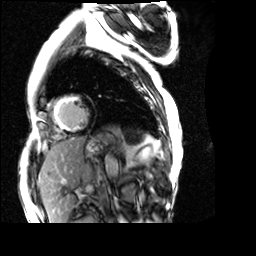
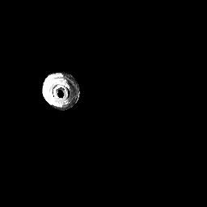
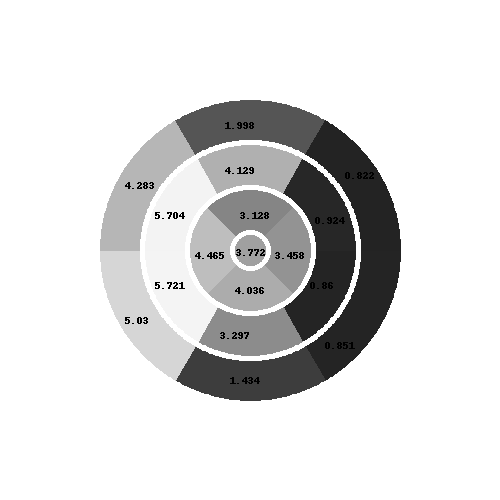

# bulls-eye-view-for-scar-tissues
A python program to detect the scar tissues in the Left Ventricle of the human heart and display the same in a Bull's eye view.

****
Requirements
==================
* Tested on Windows 10 using Python 3.6.8
* OpenCV 4.1.0
* PIL 6.1.0
* imutils 0.5.3
* numpy 1.17.0

****
Procedure
===============
The Bull's Eye view looks like this


The inputs that are given are LGE MR images and corresponding myocardium masks in 'png' format

The LGE MR image looks like this



The mask looks like this


The **Output** we got 

The stacked up image 



The Bull's Eye view



****
Usage
==========
The program can be executed in command prompt like this 
```
python main.py [directory where the MR images and mask is present]
```

The inputs in the above specified directory should have the file names as:
```
lge_[0-8].png --> LGE MR image
mask_lge_[0-8] --> LGE MR mask
```
